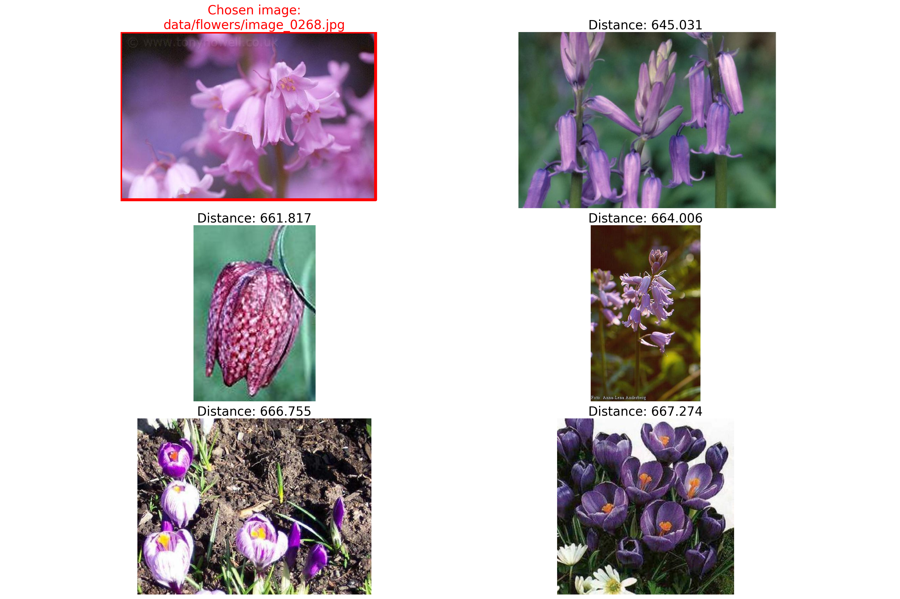

# Image search
This repository holds the code for assignment 1 for visual analytics (S2023). A simple image search algorithm based on colour histograms is implemented to find the *n* most similar images to a given image. Additionally, a K-nearest neighbour algorithm is implemented. 

## Description of the data
The dataset is a collection of images of 17 different species of flowers. For each class the dataset holds 80 images. For more information about the dataset, follow this [link](https://www.robots.ox.ac.uk/~vgg/data/flowers/17/).

## Usage and reproducibility
To find the *n* most similar images to a chosen image follow the steps below.

1. Clone the repository
2. Unzip the flowers.zip file. Can be done by running the following command from the `data` directory:
````
unzip flowers.zip
````
3. Create a virtual environment with the required packages
````
bash setup.sh
````
4. Run the following command from the root directory of the repository. This command finds the 5 most similar images to `image_0268.jpg`. The results are saved in the `out` directory.
````
bash run.sh
````

### Arguments
It is possible to specify another directory of images as well as modifying the number of similar images to be returned. To run the script with different inputs, follow the steps below.
1. create the virtual environment (if not already done)
```
bash setup.sh
```
2. activate the virtual environment
```
source env/bin/activate
```
3. Specify the target image, directory with images and number of similar images to be returned when running the script
``` 
python src/image_search.py -i <chosen_image> -d <directory_with_images> -n <number_of_similar_images>
```

## Repository structure
```
├── data                                
│   └── flowers
├── out                                 
│   ├── 5_most_similar_image_0268.csv 
│   └── 5_most_similar_image_0268.png 
├── src
│   └── image_search.py                 
├── utils                               
│   ├── __init__.py                     
│   ├── im_search.py                 
│   └── plot.py   
├── requirements.txt    
├── run.sh   
├── setup.sh                       
└── README.md                           
```


## Results
Running the script results in a csv file. The first row contains the filename of the target image and the distance to itself (0). The following rows contain the filename and distance to the *n* most similar images to the target image.

|Filename|Distance|
|---|---|
|target|0|
|filename1|---|
|filename2|---|


Additionally a plot is saved with the target image and the *n* most similar images. This can be used to inspect the results visually.

The following image shows the target image and the 5 most similar images to it.


